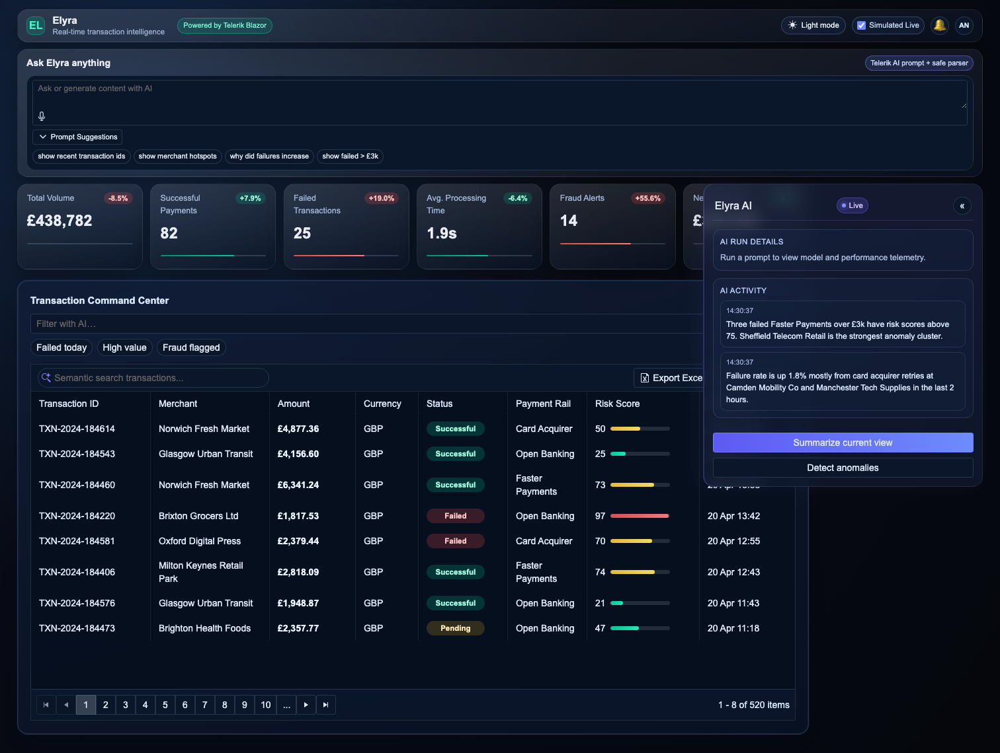
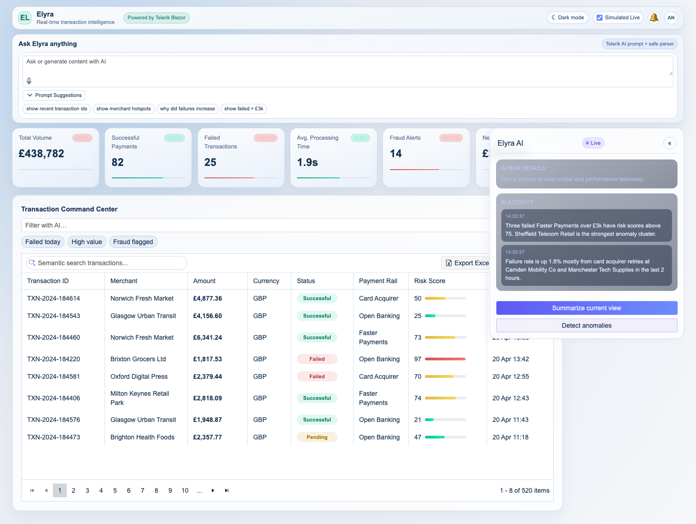

# Elyra App State and Session Retrospective

Date: 2026-04-20  
Chat discussion: [ISSUES_CHAT.md](./ISSUES_CHAT.md)
Environment: local `dotnet run` at `http://localhost:5040`

## Current App State (Captured with Playwright)

### Dark mode

### Light mode

## What We Changed During This Chat

- Added root repo `.gitignore` entries for build artifacts (`bin/`, `obj/`).
- Removed default Blazor template artifacts:
  - `Pages/Counter.razor`
  - `Pages/FetchData.razor`
  - `Shared/NavMenu.razor`
  - `Shared/SurveyPrompt.razor`
  - `Data/WeatherForecast.cs`
  - `Data/WeatherForecastService.cs`
  - `Shared/NavMenu.razor.css`
  - empty `Data` folder
- Updated `Program.cs` to remove `elyra.Data` and `WeatherForecastService` registration.
- Replaced custom KPI bar markup in `Components/Dashboard/KpiCardsSection.razor` with `TelerikProgressBar`.
- Iteratively adjusted KPI progress bar styling in `wwwroot/css/site.css` for:
  - reduced height
  - hidden progress text
  - dark/light theme track and fill appearance

## What We Attempted and Initially Failed To Do

This section captures the problems we hit before arriving at the current state.

1. **Initial Telerik ProgressBar API mismatch**
   - We first used `Min`/`Max` attributes on `TelerikProgressBar`.
   - Runtime error occurred: component did not accept `Min` in the installed Telerik version.
   - Fix: removed unsupported attributes and relied on `Value`.

2. **Dark mode styling looked incorrect despite CSS edits**
   - Symptom: bars looked too tall/white and showed `%` labels (for example `0%`).
   - Root cause: Telerik renders nested status wrapper elements (`.k-progress-status-wrap`) that were still visible.
   - Fix: explicitly hid status wrappers and status text, and targeted `.k-selected.k-progressbar-value` for fill sizing.

3. **Playwright MCP browser context failure**
   - Attempt to verify via MCP Playwright tools failed with: browser/page/context closed.
   - Workaround used: local Playwright automation via Node script to capture screenshots and inspect computed styles.

4. **Repeated “make smaller” refinements**
   - We reduced bar height multiple times (6px -> 4px -> 3px -> 2px) based on visual feedback.
   - Current state uses compact `2px` bars with tighter top spacing.

## Verification Performed

- `dotnet build` was run after each substantive change; latest build is passing.
- Playwright screenshot capture completed for both dark and light themes.
- DOM/computed style checks confirmed:
  - KPI bar height at `2px`
  - status wrappers hidden
  - theme-specific track colors applied

## Current Known Risk / Follow-up

- Visual preference for KPI bars may still require final tuning (for example, 2px vs 3px).
- If needed, do a final design sign-off pass with side-by-side screenshot diffs before locking styles.
